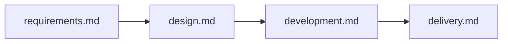

# 工作流剧本（Playbooks）

> **剧本 SSOT**：`.cursor/workflows/`  
> 触发表：`.cursor/skills/workflow-triggers/SKILL.md`

## 何时触发

用户说：

- 「需求工作流」「走需求流程」「提需求」→ **需求**
- 「设计工作流」「UI 设计」「设计稿转 Vue」→ **设计**
- 「开发工作流」「开始实现」「修 bug」→ **开发**
- 「交付工作流」「验收」「DoD」「准备 PR」→ **交付**
- 「端到端」「从需求到交付」→ 按顺序 **需求 → 设计（可选）→ 开发 → 交付**

收到上述信号时：**先读本 Skill 选定剧本，再打开对应 workflow 文件逐步执行。**

**智能体模式**：执行各阶段时对照 `.cursor/workflows/agent-patterns.md`（理论见 `ai/智能体模式.md`）— 识别路由、委派、并行、Eval、Handoff、人类确认等模式，遵守全局反模式。

---

## 四条主流程（一键索引）

| 工作流 | 剧本文件 | 终点产出 |
|--------|----------|----------|
| 需求 | `.cursor/workflows/requirements.md` | 已定稿 `docs/requirements/features/<id>.md` + 计划 + eval 草案 |
| 设计 | `.cursor/workflows/design.md` | UI 方向 / 稿转代码 / a11y 清单 / design 文档 |
| 开发 | `.cursor/workflows/development.md` | 代码 + 文档同步 + 栈审查 |
| 交付 | `.cursor/workflows/delivery.md` | DoD PASS + 可 PR |

模式对照：`.cursor/workflows/agent-patterns.md` · 总览：`.cursor/workflows/README.md`

---

## 执行协议（每条工作流通用）

1. **打开剧本** → 读对应 `workflows/<name>.md`
2. **识别模式** → 读 `workflows/agent-patterns.md` 中该工作流对应段落（路由/委派/并行/Eval…）
3. **按阶段表顺序** → 每阶段：
   - 读列出的 **Skill**（`.cursor/skills/<name>/SKILL.md`）
   - 委派列出的 **Agent**（`@name` 或 Task）
   - 遵守列出的 **Rules**（`.cursor/rules/*.mdc`）
3. **阶段门禁**未通过 → **STOP**，不进入下一阶段
4. **跨会话** → **Handoff 模式**：`dynamic-workflow-mode` + handoff 文件
5. **声称完成** → **Eval 循环**收尾：至少 `verification-gate`；完整走 **交付** 剧本

---

## 端到端串联（新功能默认）

```
需求工作流（定稿）
  → 设计工作流（有大 UI 时）
  → 开发工作流
  → 交付工作流
```



---

## 与各 Skill 关系

| 本剧本 | 不替代 | 说明 |
|--------|--------|------|
| workflow-playbooks | `workflow-triggers` | triggers 负责**信号路由**；playbooks 负责**阶段串联** |
| workflow-playbooks | 各阶段 Skill | 剧本指向具体 Skill，不重复 Skill 内步骤 |

---

## 维护

- 改阶段顺序 / 增删 Agent/Rule → 改 `workflows/*.md`
- 新增第四条以外的流程 → 新增 `workflows/<name>.md` + 更新本文件索引 + `workflow-triggers`
