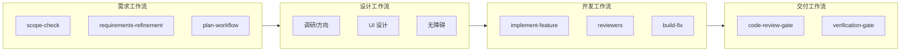

# 工作流剧本（Playbooks）

> **把 Skill、Agent、Rule 串成可复述的端到端流程。**  
> 入口 Skill：`.cursor/skills/workflow-playbooks/SKILL.md`  
> 触发表：`.cursor/skills/workflow-triggers/SKILL.md`

---

## 四条主工作流

| 工作流 | 文件 | 典型口令 |
|--------|------|----------|
| **需求** | [requirements.md](./requirements.md) | 「按需求工作流」「提需求」「需求定稿」 |
| **设计** | [design.md](./design.md) | 「走设计工作流」「UI 设计」「设计稿转 Vue」 |
| **开发** | [development.md](./development.md) | 「按开发工作流」「实现功能」「修 bug」 |
| **交付** | [delivery.md](./delivery.md) | 「交付工作流」「验收」「准备 PR」 |
| **智能体模式** | [agent-patterns.md](./agent-patterns.md) | 路由/委派/并行/Eval/Handoff 与各工作流对照 |

---

## 智能体模式层

四条工作流不是平铺步骤，而是叠加 **智能体常见模式**（见 `ai/智能体模式.md`）：

| 模式 | 在工作流中的位置 |
|------|------------------|
| **路由** | 入口：`workflow-triggers` → `workflow-playbooks` |
| **顺序编排** | 需求定稿 → 计划 → 实现 → 审查 → 交付 |
| **委派** | 各阶段 `@*` Agent（构建/审查/架构 specialist） |
| **并行化** | 开发：`parallel-execution`；只读 lane、双 reviewer |
| **Eval 循环** | 需求末 Define → 开发 Implement → 交付 Evaluate |
| **Handoff** | 需求多轮、`dynamic-workflow-mode` |
| **人类确认门禁** | 需求定稿、`plan-workflow`、`split-prs` |

**可执行对照表**： [agent-patterns.md](./agent-patterns.md)

---

## 总览（端到端）

**说明**：设计可与需求并行（UI 探索）；开发前需求须**已定稿**（新能力）。交付工作流在每次声称完成时执行。

---

## 共用 Rule 层（始终生效）

| Rule | 作用 |
|------|------|
| `workflow-triggers.mdc` | 路由到 Skill / 剧本 |
| `ai-execution.mdc` | 子代理、DoD、重启义务 |
| `project-core.mdc` | 项目不变量 |
| `common-*.mdc` | ECC 编码/安全/Git/测试基线 |

栈相关 Rule 在各工作流阶段表中按路径加载（`backend-spring`、`frontend-react`、`vue-*` 等）。

---

## 如何选择

| 你想做什么 | 从哪条开始 |
|------------|------------|
| 还不清楚要不要做、范围多大 | 需求 → `scope-check` |
| 写需求文档、验收标准 | 需求 → `requirements-refinement` |
| 市场调研、竞品 | 需求 → `market-research` / `@marketing-agent` |
| 定 UI 方向、改界面质感 | 设计 → `frontend-design-direction` |
| 截图批量转 Vue | 设计 → `ui-to-vue` |
| 写代码、改 bug | 开发 → `implement-feature` |
| 声称做完、要 PR | 交付 → `verification-gate` |

---

## 维护

- 新增阶段：改对应 `workflows/*.md`，并更新 `workflow-playbooks` Skill
- 新增 Skill 触发：仍只改 `workflow-triggers/SKILL.md`
