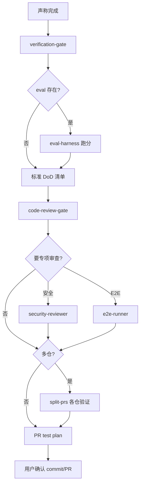

# 交付工作流

> **目标**：可重复的 DoD 验收、eval 回归、PR 就绪。**每次声称完成或 stop hook 时执行。**

## 入口口令

- 「交付工作流」「验收」「DoD」「准备 PR」「可以交付了吗」
- 「code review」→ 阶段 2 加强
- 「拆 PR」→ `split-prs` 后各仓重复本流程

## 流程图

---

## 阶段串联表

> **模式列**：见 [agent-patterns.md](./agent-patterns.md#交付工作流--模式)

| 阶段 | 模式 | Skill | Agent | Rules | 产出 |
|------|------|-------|-------|-------|------|
| **1 DoD** | **Eval 循环**、顺序编排 | `verification-gate` | `@qa-engineer` | `ai-execution.mdc`、`common-testing.mdc` | PASS/FAIL 清单 |
| **2 Eval** | **Eval 循环** | `eval-harness` | — | — | EVAL REPORT 更新 |
| **3 构建** | 顺序编排 | — | `@qa-engineer` | 栈 testing rules | build + test PASS |
| **4 后端冒烟** | 顺序编排、错误恢复 | `backend-verify` | `@qa-engineer` | `backend-spring.mdc` | 重启后 HTTP 冒烟 |
| **5 审查门禁** | 委派、并行化 | `code-review-gate` | `@code-reviewer` | `common-code-review.mdc` | 无 BLOCKER |
| **6 专项** | 委派、模型路由 | — | `@security-reviewer` 等 | `common-security.mdc` | 专项报告 |
| **7 拆 PR** | **人类确认**、顺序编排 | `split-prs` | — | `common-git-workflow.mdc` | 各 PR 范围说明 |
| **8 文档** | 委派 | — | `@doc-updater`（可选） | `docs-maintenance.mdc` | README/变更说明 |

---

## DoD 速查（与 `verification-gate` 一致）

- [ ] `cd frontend && npm run build`（或项目命令）
- [ ] `.\mvnw.cmd test` / `mvn test`（有 backend 时）
- [ ] 改 backend：进程已重启 + 关键接口冒烟
- [ ] 契约文档与代码一致（`@doc-sync`）
- [ ] 新能力：需求文档状态为**已定稿**
- [ ] eval capability / regression 已填
- [ ] 无未解释的 BLOCKER 审查项

---

## 用户确认后

- 按 `common-git-workflow.mdc` 写 commit / PR description
- **仅当用户明确要求**时 commit / push

---

## 反模式

- 臆造测试通过
- 跳过构建直接 PR
- 未跑 `verification-gate` 响应 stop hook
