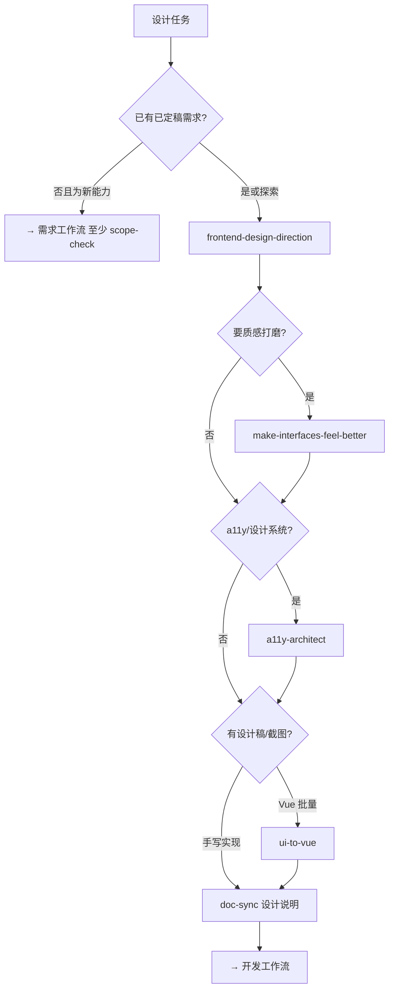

# 设计工作流

> **目标**：从需求/调研到可实现的 UI 方向、可选设计稿落地、无障碍与文档同步。  
> **可与需求并行**（探索期）；**实现前**须与已定稿需求对齐。

## 入口口令

- 「走设计工作流」「UI 设计」「界面方向」「更精致」
- 「设计稿转 Vue」「截图转页面」→ 阶段 4
- 「无障碍」「a11y」→ 阶段 3

## 流程图

---

## 阶段串联表

> **模式列**：见 [agent-patterns.md](./agent-patterns.md#设计工作流--模式)

| 阶段 | 模式 | Skill | Agent | Rules（本阶段必读） | 产出 | 门禁 |
|------|------|-------|-------|----------------------|------|------|
| **0 对齐** | 路由、顺序编排 | `scope-check`（新能力） | `@product-manager` | `project-core.mdc` | UI 范围 IN/OUT | 超需求 → STOP |
| **1 方向** | 委派、模型路由 | `frontend-design-direction` | — | `frontend-react.mdc` 或 `frontend-vue.mdc` | 色调/布局/交互原则 | 先定方向再写代码 |
| **2 质感** | 委派 | `make-interfaces-feel-better` | — | 同上 + `common-coding-style.mdc` | 组件层级/动效建议 | 不破坏 a11y |
| **3 无障碍** | 委派 | — | `@a11y-architect` | `common-security.mdc` | a11y 清单、ARIA 要求 | WCAG 关键项 |
| **4 稿转代码** | 委派、顺序编排 | `ui-to-vue` | `@frontend-vue-dev` | `vue-*.mdc`、`frontend-vue.mdc` | `.vue` 初版 + 路由草图 | 仅 Vue 栈 |
| **5 设计文档** | 委派 | — | `@doc-sync` | `docs-maintenance.mdc` | `docs/design/` UI 说明 | 与需求验收一致 |
| **6 架构 UI** | 委派、并行标 Lane | `blueprint`（大改版） | `@code-architect` | `api-contracts.mdc` | 组件/路由拆分计划 | 多页联动时 |

---

## 栈分支

| 前端栈 | Rules | Agents |
|--------|-------|--------|
| React | `frontend-react.mdc`、`react-*.mdc` | `@frontend-dev`、`@react-reviewer` |
| Vue 3 | `frontend-vue.mdc`、`vue-*.mdc` | `@frontend-vue-dev`、`@vue-reviewer` |

---

## 调研（设计向）

| 场景 | Skill | Agent |
|------|-------|-------|
| 竞品 UI/定位 | `market-research` | `@marketing-agent` |
| 设计趋势/技术选型 | `deep-research` | — |
| 调研运维/归档 | `research-ops` | — |

---

## 与下游衔接

- 有 API 变更意图 → `@architect` + `api-contracts.mdc`，再 `@doc-sync`
- UI 就绪 → [开发工作流](./development.md) 阶段 1（`implement-feature`）

---

## 反模式

- 未定 UI 方向就大批量写页面
- `v-html` / 未消毒富文本（见 `vue-security` / `react-security`）
- 设计稿转代码后不跑 `@vue-reviewer` / `@react-reviewer`
