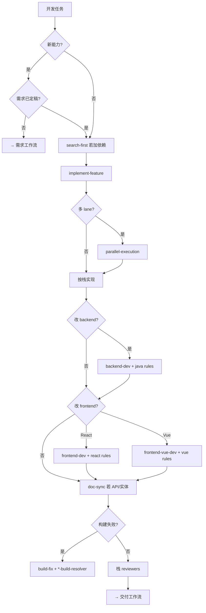

# 开发工作流

> **目标**：在门禁满足的前提下纵向切片实现，栈审查通过后进入交付工作流。

## 入口口令

- 「按开发工作流」「开始实现」「修 bug」「改接口」
- 「构建失败」→ 阶段 4 `build-fix`
- 「并行开发」→ `parallel-execution`

## 前置门禁（新能力）

- [ ] `docs/requirements/features/<id>.md` **已定稿**
- [ ] `plan-workflow` 已确认（或用户明确「直接做」并记录风险）
- [ ] `.cursor/evals/<feature>.md` 已起草（建议）

小改 / bug：**可跳过**需求沉淀，但仍须 `scope-check` 确认范围。

## 流程图

---

## 阶段串联表

> **模式列**：见 [agent-patterns.md](./agent-patterns.md#开发工作流--模式)

| 阶段 | 模式 | Skill | Agent | Rules（按路径加载） | 产出 |
|------|------|-------|-------|----------------------|------|
| **0 门禁** | 顺序编排、路由 | `scope-check` | — | `project-core.mdc` | 范围确认 |
| **1 依赖** | 委派、并行（只读） | `search-first` | `@code-explorer` | `common-security.mdc` | 依赖决策记录 |
| **2 实现** | **顺序编排**、委派 | `implement-feature` | `@backend-dev` / `@frontend-dev` / `@frontend-vue-dev` | 见「栈 Rules」 | 代码 + migration |
| **3 并行** | **并行化** | `parallel-execution` | Task `explore` 等 | `common-agents.mdc` | 多 lane 结果合并 |
| **4 构建修复** | **错误恢复**、委派 | `build-fix` | `*-build-resolver` | 栈 `*-patterns.mdc` | 构建 PASS |
| **5 API/实体** | 委派、顺序编排 | — | `@doc-sync` | `api-contracts.mdc`、`docs-maintenance.mdc` | design 文档同步 |
| **6 数据** | 委派 | — | `@database-reviewer` | `java-*.mdc` | migration 审查 |
| **7 栈审查** | 委派、**并行化** | `code-review-gate` | 见「栈 Agents」 | `common-code-review.mdc` | 审查意见 |
| **8 后端深验** | 顺序编排 | `backend-verify` | `@qa-engineer` | `backend-spring.mdc` | 重启 + 冒烟 |

### 栈 Rules

| 改动路径 | Rules |
|----------|-------|
| `backend/**` | `backend-spring.mdc`、`java-*.mdc`、`api-contracts.mdc` |
| `frontend/**`（React） | `frontend-react.mdc`、`react-*.mdc`、`typescript-*.mdc` |
| `frontend/**`（Vue） | `frontend-vue.mdc`、`vue-*.mdc`、`typescript-*.mdc` |
| `docs/design/**` | `docs-maintenance.mdc`、`api-contracts.mdc` |

### 栈 Agents（交付前建议）

| 改动 | Agent |
|------|-------|
| Java | `@java-reviewer` |
| React TSX | `@react-reviewer` + `@typescript-reviewer` |
| Vue SFC | `@vue-reviewer` + `@typescript-reviewer` |
| 安全/JWT | `@security-reviewer` |
| 大改 | `@code-reviewer` |

---

## 硬义务

- 改 `backend/**` 后：**重启** + HTTP 冒烟（见 `ai-execution.mdc`）
- 新 API：路径与 `docs/design/03-API设计.md` 一致
- 用户未要求：**不** commit / push

---

## 与下游衔接

实现与审查完成后 → [交付工作流](./delivery.md)

---

## 反模式

- 新 Controller/migration 无已定稿需求
- Controller 写业务逻辑（见 `backend-spring.mdc`）
- 跳过栈 reviewer 声称完成
- 写 lane 并行编辑同一文件
