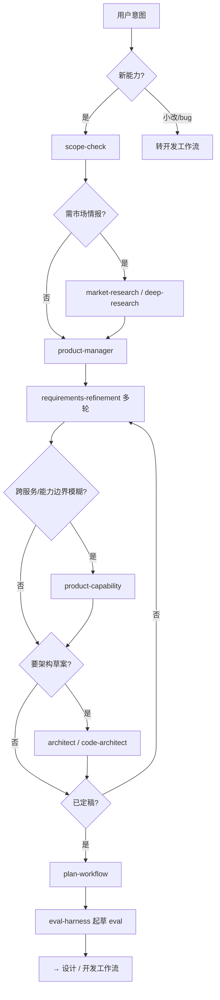

# 需求工作流

> **目标**：从模糊想法到**已定稿**需求文档 + 可选实现计划，**禁止**未定稿就编码（新能力）。

## 入口口令

- 「按需求工作流」「走需求流程」「提需求」「需求定稿」
- 「市场调研」「竞品分析」→ 从阶段 1b 切入

## 流程图

---

## 阶段串联表

> **模式列**：见 [agent-patterns.md](./agent-patterns.md#需求工作流--模式)

| 阶段 | 模式 | Skill | Agent | Rules（本阶段必读） | 产出 | 门禁 |
|------|------|-------|-------|----------------------|------|------|
| **0 范围** | 路由、顺序编排 | `scope-check` | `@product-manager`（可选） | `project-core.mdc`、`docs-maintenance.mdc` | IN/OUT SCOPE | 超 capability → STOP |
| **1a 调研** | 委派 | `market-research` | `@marketing-agent` | `common-security.mdc` | 竞品/受众摘要 | 关键结论有来源 |
| **1b 深度调研** | 委派、并行（只读） | `deep-research` | — | 同上 | 带引用研究报告 | 需 MCP 或 WebSearch |
| **2 沉淀** | **需求沉淀**、人类确认、Handoff | `requirements-refinement` | `@product-manager` | `docs-maintenance.mdc` | `docs/requirements/features/<id>.md` | 多轮至定稿 |
| **3 能力约束** | 委派、模型路由 | `product-capability` | `@product-manager` | `project-core.mdc` | 能力清单/约束 | 跨服务时必做 |
| **4 架构对齐** | 委派、模型路由 | — | `@architect`、`@code-architect` | `api-contracts.mdc` | API/数据流草案、ADR 建议 | 新 API 须对齐契约 |
| **5 文档同步** | 委派、顺序编排 | — | `@doc-sync` | `api-contracts.mdc`、`docs-maintenance.mdc` | 更新 design 草案 | 与需求一致 |
| **6 计划** | **人类确认**、委派、并行标 Lane | `plan-workflow` | `@planner` | `api-contracts.mdc` | 实现计划（用户确认） | **需求已定稿** |
| **7 Eval 草案** | **Eval 循环**（Define） | `eval-harness` | — | — | `.cursor/evals/<feature>.md` | 成功标准可执行 |

---

## 跨会话

- **Handoff 模式**：`dynamic-workflow-mode` + `.cursor/evals/_example-requirements-handoff.md` 格式 → `docs/requirements/features/<id>-handoff.md`

---

## 与下游衔接

| 已定稿后 | 下一步 |
|----------|--------|
| 有大 UI 改动 | [设计工作流](./design.md) |
| 直接实现 | [开发工作流](./development.md)（须 eval 已起草） |
| 仅交付范围变更 | 更新 `docs/product/capability.md` + `@doc-sync` |

---

## 反模式

- 跳过 `requirements-refinement` 直接 `implement-feature`（新能力）
- 开放问题未关闭却标记「已定稿」
- 在 Rule 里写长篇需求（应写 `docs/requirements/`）
