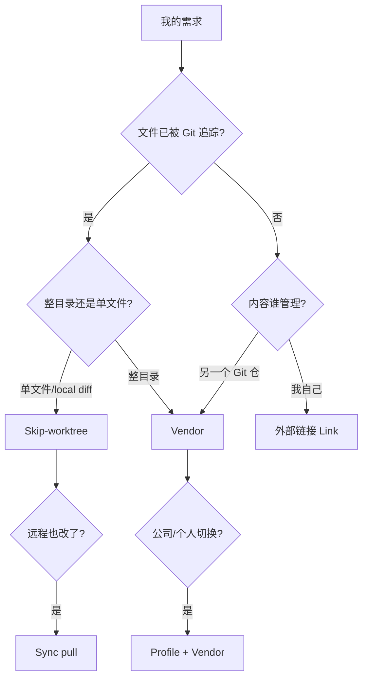

# gitmove GUI 交互设计

**状态**：设计稿 · 随 [gitmove-gui-ux-redesign.md](../requirements/features/gitmove-gui-ux-redesign.md) 定稿  
**技术栈**：CustomTkinter（**非 Vue**）

---

## 1. 设计目标

| 目标 | 度量 |
|------|------|
| **3 秒懂选型** | 新用户读「开始」Tab 任一场景卡片 ≤10 秒能点进正确 Tab |
| **可行动概览** | doctor error 100% 有可见下一步（按钮或复制命令） |
| **能力parity** | CLI 核心能力（vendor/profile/sync）在 GUI 可发现，Phase 1 至少可查看 |

---

## 2. 用户心智模型



GUI「开始」Tab 即此图的 **扁平化快捷入口**，避免用户先理解 Git 概念。

---

## 3. 线框（Phase 1）

### 3.1 开始 Tab

```text
┌─ 你想做什么？ ─────────────────────────────────────────────┐
│ ┌─────────────┐ ┌─────────────┐ ┌─────────────┐              │
│ │ 📄 本地改    │ │ 📁 目录放盘外 │ │ 🔗 上游 Git 仓 │              │
│ │ 已追踪文件   │ │ 未追踪      │ │ Vendor      │              │
│ │ → Skip      │ │ → Link      │ │ → Vendor    │              │
│ └─────────────┘ └─────────────┘ └─────────────┘              │
│ ┌─────────────┐ ┌─────────────┐ ┌─────────────┐              │
│ │ 🔄 规范切换  │ │ ⚡ 远程冲突  │ │ 🌿 多分支    │              │
│ │ Profile     │ │ Sync        │ │ Worktree    │              │
│ └─────────────┘ └─────────────┘ └─────────────┘              │
│ [打开完整场景手册]                                            │
└──────────────────────────────────────────────────────────────┘
```

**组件映射**（`gui/scenarios.py` 建议）：

```python
@dataclass(frozen=True)
class ScenarioCard:
    id: str
    title: str
    subtitle: str
    target_tab: str
    doc_anchor: str  # workflows.md section
```

### 3.2 概览 Tab（重构）

```text
┌ 健康检查 ────────────────────────────────────────────────────┐
│  ✓ 0 错误   ⚠ 1 警告   ℹ 2 提示          [重新检查] [一键应用] │
├──────────────────────────────────────────────────────────────┤
│ 级别 │ 分类   │ 说明                        │ 操作          │
│ ERR  │ vendor │ 链接缺失 .cursor            │ [修复]        │
│ WARN │ link   │ migrate 跳过 socket         │ [查看]        │
├──────────────────────────────────────────────────────────────┤
│ 外部目录默认根路径: [________________________] [保存]         │
└──────────────────────────────────────────────────────────────┘
```

**实现要点**：

- 抽 `format_doctor_summary(report) -> str` 与 `doctor_issues_for_tree(report) -> list[Row]` 便于单测  
- 「修复」映射 `errors.remediation_for_doctor` 已有逻辑  

### 3.3 Vendor Tab（Phase 1 只读）

```text
┌ 上游 Vendor ─────────────────────────────────────────────────┐
│ 从其他 Git 仓库挂载目录（如 .cursor）。不改 .gitignore。        │
│ [刷新]  [在终端添加 vendor…]  [打开文档]                       │
├──────────────────────────────────────────────────────────────┤
│ 名称 │ 路径 │ 上游 │ Pin │ 状态 │ [Sync] [复制 CLI]          │
└──────────────────────────────────────────────────────────────┘
```

**Phase 2（可视化 add/sync/remove）** → [gui-vendor-phase2.md](./gui-vendor-phase2.md)

### 3.4 Profile Tab

```text
┌ 策略 Profile ────────────────────────────────────────────────┐
│ 当前: personal    切换后自动 apply（含 .cursor vendor  reconcile）│
│ Profile: [ company ▼ ]  [切换]  [dry-run 预检]  [保存当前为…]  │
│ ───────────────────────────────────────────────────────────── │
│ company: 公司 .cursor 基线（Git 检出）                         │
│ personal: 个人 Vendor + skip                                   │
└──────────────────────────────────────────────────────────────┘
```

---

## 4. 模块拆分（实现蓝图）

| 模块 | 职责 |
|------|------|
| `gui/scenarios.py` | 场景卡片 metadata + `navigate(app, scenario_id)` |
| `gui/overview.py` | doctor 格式化、Treeview 填充、修复 dispatch |
| `gui/vendor_panel.py` | Vendor 列表/操作（Phase 1 只读） |
| `gui/profile_panel.py` | Profile 下拉与切换 |
| `gui/empty_state.py` | 各 Tab 空状态 HTML/Markdown 转 CTkLabel |
| `gui/app.py` | 组装 Tab，保持 &lt;600 行（大面板外移） |

**并行 Lane（Phase 1）**：

| Lane | 文件 | 依赖 |
|------|------|------|
| A | scenarios + 开始 Tab | 无 |
| B | overview 重构 | doctor/errors |
| C | vendor_panel | vendor_mod |
| D | profile_panel | profile_mod |
| E | empty_state 文案 | docs 链接 |

Lane A/B 可并行；C/D 依赖业务 API 已存在（已满足）。

---

## 5. TDD 切片顺序

```text
1. scenarios.py 单元测（卡片数量、target_tab）
2. overview.py 单元测（分级、排序 error 优先）
3. app.py 接「开始」Tab + test_scenario_navigate
4. empty_state 快照测（文案含关键词）
5. vendor_panel / profile_panel 集成测
6. 手工：S3 .cursor vendor 场景走通
```

---

## 6. 与 ui-to-vue 的关系

**不使用 ui-to-vue**。若未来需要营销站/文档站 Vue 化，与 **桌面 GUI** 分离；桌面端继续 CustomTkinter 以降低打包复杂度。

---

## 7. 开放问题

继承需求文档 Q1–Q4；设计层补充：

| ID | 问题 | 建议 |
|----|------|------|
| D1 | 场景卡片是否用 emoji？ | **已定**：Minimalism 用序号 01–06 + 排版层级，不用 emoji（见 [gui-visual-style.md](./gui-visual-style.md)） |
| D2 | 「打开文档」指向本地 md 还是 GitHub？ | 优先本地 `docs/guides/workflows.md` |

---

## 8. 参考

- 竞品：通用 Git GUI 弱 skip/vendor → gitmove 应用**场景教育**差异化  
- 内部：`ErrorDialog` 已有 remediation 模式，概览页与之统一视觉语言  
- **视觉风格**：[gui-visual-style.md](./gui-visual-style.md)（Minimalism 色彩、组件、场景序号）
- **Vendor Phase 2**：[gui-vendor-phase2.md](./gui-vendor-phase2.md)（添加/Sync/移除对话框）
