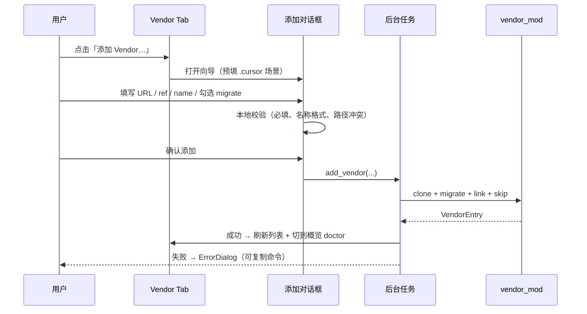

# gitmove GUI · Vendor Tab Phase 2 交互与 UI 设计

**状态**：Phase 2 已实现（add/sync/remove 对话框 + 状态列）  
**依赖**：[gui-ux.md](./gui-ux.md) · [gui-visual-style.md](./gui-visual-style.md) · [gitmove-gui-ux-redesign.md](../requirements/features/gitmove-gui-ux-redesign.md) GUX-7  
**业务 API**：`vendor.add_vendor` · `sync_vendor` · `remove_vendor` · `check_vendor_updates` · `vendor_status`

---

## 1. 设计目标

| 目标 | 说明 |
|------|------|
| **零 CLI 添加** | 典型 `.cursor` 个人 Vendor 可在 GUI 完成 add → 刷新 → sync |
| **状态可读** | 列表一眼看出：正常 / 落后 / pin 漂移 / 链接异常 / cache 脏 |
| **危险操作可逆感知** | remove / migrate 前明确后果，默认保守选项 |
| **与 CLI 同源** | 表单字段 1:1 映射 CLI；不引入 GUI 专有语义 |

**非目标（Phase 2）**：模板编辑器、多 include_path、submodule 替代、Profile 向导（仍用 Profile Tab）。

---

## 2. 用户旅程

### J1 · 首次添加个人 `.cursor` Vendor（主路径）



### J2 · 更新上游

用户选中一行 → **Sync** → 确认（若 cache dirty 警告）→ 后台 `sync_vendor` → 行状态更新。

### J3 · 拆除 Vendor（Profile 切换前）

选中 → **移除…** → 对话框选项 `保留 skip` / `删除 cache` → `remove_vendor` → 刷新。

---

## 3. Vendor Tab 线框（Phase 2）

```text
┌─ 上游 Vendor ─────────────────────────────────────────────────────────────┐
│ 从其他 Git 仓库挂载目录（如 .cursor）。不改 .gitignore。                      │
│                                                                             │
│ [+ 添加 Vendor…]  [检查更新]  [全部 Sync]  [刷新]  [打开文档]                │
├─────────────────────────────────────────────────────────────────────────────┤
│ 名称      │ 路径    │ 上游              │ Pin   │ 状态      │ 操作        │
│ personal… │ .cursor │ github.com/… @main│ v1.0  │ ● 正常    │ Sync 移除…  │
│ tools     │ tools/  │ github.com/… @main│ —     │ ⚠ 落后 2  │ Sync 移除…  │
├─────────────────────────────────────────────────────────────────────────────┤
│ （空状态时）EmptyStatePanel + 主按钮 [添加 Vendor…]                          │
└─────────────────────────────────────────────────────────────────────────────┘
```

### 3.1 工具栏按钮

| 按钮 | 行为 | 禁用条件 |
|------|------|----------|
| **+ 添加 Vendor…** | 打开 `VendorAddDialog` | 无 repo / busy |
| **检查更新** | `check_vendor_updates(fetch=True)`，结果 toast + 刷新状态列 | 无 vendor / busy |
| **全部 Sync** | 对全部 vendor 顺序 sync，汇总结果对话框 | 无 vendor / busy |
| **刷新** | 现有 `refresh_all` | busy |
| **打开文档** | 打开 `workflows.md` Vendor 章节 | — |

Phase 1 的「复制添加 CLI」降为对话框内 **高级** 折叠区链接，主路径不再依赖剪贴板。

### 3.2 表格列

| 列 | 数据源 | 展示规则 |
|----|--------|----------|
| 名称 | `VendorStatus.name` | 左对齐，过长 ellipsis |
| 路径 | `repo_path` | monospace 倾向 |
| 上游 | `source_url @ source_ref` | 域名省略显示，tooltip 全文 |
| Pin | `source_pin` 或 `—` | pin 漂移时 ⚠ 色 |
| 状态 | `VendorSyncResult` 或 list 静态 | 见 §4 |
| 操作 | — | 行内 **Sync** · **移除…**（Phase 2 去掉「复制 CLI」为默认，保留在右键/详情） |

**行选中**：单击选中；双击打开 **Vendor 详情侧板**（Phase 2.1 可选，v2 可只做详情对话框）。

---

## 4. 状态语义与视觉

合并 `VendorStatus`（list）与 `VendorSyncResult`（check/sync）为统一展示枚举：

| 显示 | 条件 | 颜色令牌 |
|------|------|----------|
| **● 正常** | link_ok ∧ cache_exists ∧ ¬behind ∧ ¬pinned_drift ∧ ¬dirty | `success` |
| **⚠ 落后 N** | `behind > 0` | `warning` |
| **⚠ Pin 漂移** | `pinned_drift` | `warning` |
| **⚠ Cache 有改动** | `dirty` | `warning` |
| **✗ 链接异常** | ¬link_ok | `error` |
| **✗ Cache 缺失** | ¬cache_exists | `error` |
| **— 未检查** | 仅 list、未 fetch | `text_muted` |

刷新 Tab 时：**先 list**（快速），用户点「检查更新」或行内 Sync 前再 **fetch**（可配置默认 fetch on tab enter = false，避免卡顿）。

---

## 5. 添加 Vendor 对话框

### 5.1 布局（CTkToplevel · 560×520 · 可滚动）

```text
┌ 添加 Vendor ─────────────────────────────────────────────── [×] ┐
│ ○ 快速：个人 .cursor    ○ 自定义路径    （场景预设，可选）       │
├───────────────────────────────────────────────────────────────┤
│ 挂载路径 *     [ .cursor                              ] [浏览] │
│                仓库内相对路径                                   │
│ Vendor 名称 *  [ personal-cursor                     ]         │
│                字母数字_- ，默认由路径生成                       │
│ 上游 URL *     [ https://github.com/...              ]         │
│ 分支 / Tag     [ main                                  ]         │
│ Pin（可选）    [ v1.0.0                                ]         │
│                锁定 tag 或 commit SHA                           │
├─ 选项 ────────────────────────────────────────────────────────┤
│ [✓] 迁移已有目录 (--migrate)   若路径已存在且非 link，合并进 cache │
│ [✓] 自动 skip 已追踪文件       默认开，与 CLI 一致               │
│ [ ] 浅克隆                       默认开                          │
│ 链接类型       ( ) junction  (•) 自动                          │
├─ 高级 ▼ ──────────────────────────────────────────────────────┤
│ Cache 路径     [ 留空=~/gitmove-vendor/<name>        ]         │
│ Include 子路径 [ 留空=整仓 cache 根                    ]         │
│ 等价 CLI 预览  gitmove vendor add .cursor --from ...           │
├───────────────────────────────────────────────────────────────┤
│              [取消]                    [添加]（主按钮）          │
└───────────────────────────────────────────────────────────────┘
```

### 5.2 字段校验（提交前 · 纯函数可单测）

| 字段 | 规则 | 错误文案 |
|------|------|----------|
| 挂载路径 | 非空、相对路径、无 `..` | 「请输入仓库内相对路径」 |
| 名称 | `VENDOR_NAME_PATTERN`、不重复 | 「名称无效或已存在」 |
| URL | 非空、`http(s)://` 或 `git@` | 「请输入有效的 Git URL」 |
| ref | 非空 | 「请输入分支或 tag」 |
| migrate | 路径存在且非 link 时建议默认勾选 | 信息条非阻断 |

**路径已存在**：若未勾选 migrate → 展示 inline 警告 + 禁用「添加」，或弹窗「是否勾选迁移已有目录？」。

### 5.3 场景预设「个人 .cursor」

点击后预填：

| 字段 | 默认值 |
|------|--------|
| 挂载路径 | `.cursor` |
| 名称 | `personal-cursor` |
| migrate | **勾选** |
| auto_skip | **勾选** |

URL / ref / pin 留空由用户填；底部链接「从 cursor-vendor-profile 文档复制示例」。

### 5.4 提交流程

1. 禁用表单 + 主窗口 busy  
2. 标题改为「正在 clone 上游…」（可阶段：`clone` → `migrate` → `link`）  
3. 成功：`messagebox.showinfo` 摘要 + 关闭对话框 + `refresh_all` + 可选 `tabs.set("概览")`  
4. 失败：`show_gitmove_error`，对话框保持打开便于改参数  

**耗时**：>3s 显示 indeterminate progress bar（CTkProgressBar `mode="indeterminate"`）。

---

## 6. Sync 交互

### 6.1 行内 Sync

```text
用户点击 Sync
  → 若 cache dirty：确认「cache 有未提交改动，继续 sync 可能覆盖？」
  → 后台 sync_vendor(name, fetch=True)
  → 成功：状态列更新 + 「已更新 v1.0 → v1.1」toast
  → 失败：ErrorDialog
```

### 6.2 全部 Sync

顺序执行；结果对话框表格：

| Vendor | 结果 | 说明 |
|--------|------|------|
| personal-cursor | 已更新 | abc1234 → def5678 |
| tools | 跳过 | 已是最新 |

---

## 7. 移除 Vendor 对话框

```text
┌ 移除 Vendor: personal-cursor ─────────────────────────────┐
│ 将拆除挂载点 `.cursor` 的 link，并从配置中删除此 Vendor。    │
│                                                             │
│ [✓] 保留 skip-worktree（推荐，Profile 切换常用）             │
│ [ ] 同时删除本地 cache 目录（不可恢复）                      │
│                                                             │
│ Cache: C:\Users\...\gitmove-vendor\personal-cursor           │
│                                                             │
│              [取消]              [确认移除]（destructive 色） │
└─────────────────────────────────────────────────────────────┘
```

- **确认移除** 使用 `palette.error` 描边/文字，二次确认若勾选 purge_cache  
- 调用 `remove_vendor(..., purge_cache=..., keep_skip=...)`

---

## 8. 空状态（Phase 2 升级）

替换纯文案为 **可行动空状态**：

```text
┌──┬──────────────────────────────────────────────────────────┐
│█ │ 尚未配置 Vendor                                          │
│█ │ 适用：目录内容来自另一个 Git 仓库（如 .cursor 规范仓）     │
│█ │ 不适用：仅本地盘外目录 → 请用「外部链接」                  │
│█ │                                                          │
│█ │        [ + 添加 Vendor… ]    [ 查看 .cursor 场景文档 ]    │
└──┴──────────────────────────────────────────────────────────┘
```

左侧色条使用 Vendor 场景 accent `#6C5CE7`（与开始 Tab S3 一致）。

---

## 9. 模块与文件规划

| 模块 | 职责 |
|------|------|
| `gui/vendor_panel.py` | 行数据、`status_label()`、`vendor_tree_rows` 扩展状态列 |
| `gui/vendor_forms.py` | **新增** · 表单校验、`build_add_payload()`、CLI 预览字符串 |
| `gui/vendor_dialogs.py` | **新增** · `VendorAddDialog` · `VendorRemoveDialog` · `VendorSyncResultDialog` |
| `gui/app.py` | Vendor Tab 工具栏、行内按钮、调用 dialogs |
| `gui/widgets.py` | 复用 `ElevatedPanel` · `primary_button` · `EmptyStatePanel` |

**app.py 增量**：Vendor Tab 构建迁入 `VendorPanel` 类（可选 Phase 2.1），目标 Vendor 相关 UI &lt; 200 行在 app 内。

---

## 10. 与 Profile / Doctor 联动

| 事件 | 联动 |
|------|------|
| add 成功 | 刷新概览 doctor；状态栏 `N vendor` |
| remove 前 | 若 active profile 引用该 vendor → 警告「请先切换 Profile」 |
| doctor vendor error | 概览「修复」→ 跳转 Vendor Tab 并选中对应行 |

---

## 11. TDD 切片（实现顺序）

```text
1. vendor_forms.py 单元测：校验、预设、CLI 预览
2. vendor_panel.status_label() 单元测：各 VendorSyncResult 组合
3. VendorAddDialog 集成测：mock add_vendor，断言参数
4. app Vendor Tab：工具栏 + 行内 Sync（mock sync_vendor）
5. Remove 对话框 + 空状态 CTA
6. 手工：.cursor + migrate 全链路
```

| ID | 测试 |
|----|------|
| T-V1 | `test_vendor_form_validate_rejects_bad_name` |
| T-V2 | `test_vendor_form_preset_cursor_fills_defaults` |
| T-V3 | `test_status_label_behind_shows_warning` |
| T-V4 | `test_vendor_add_dialog_calls_add_vendor` |
| T-V5 | `test_vendor_tab_sync_selected` |

---

## 12. 开放问题（建议默认）

| ID | 问题 | 建议默认 |
|----|------|----------|
| VQ1 | 进入 Vendor Tab 是否自动 check-updates？ | **否**，用户点「检查更新」 |
| VQ2 | add 成功后是否自动打开概览？ | **是**（仅当 doctor 有 warn/error） |
| VQ3 | 是否支持 `--template` 下拉？ | Phase 2.1，v2 先做 cursor 预设 |
| VQ4 | 行内操作 vs 右键菜单 | Phase 2 仅行内按钮；右键 2.1 |
| VQ5 | 复制 CLI 保留吗？ | 保留在添加对话框「高级」区 |

---

## 13. 参考

- CLI 参数：`cli.py` · `vendor_add_cmd` / `vendor_sync_cmd` / `vendor remove`  
- 业务错误码：`VENDOR_PATH_EXISTS` 等 → ErrorDialog  
- 视觉：[gui-visual-style.md](./gui-visual-style.md) §4、§5 场景 accent  
- 工作流：[workflows.md](../guides/workflows.md) · [gitmove-cursor-vendor-profile.md](../requirements/features/gitmove-cursor-vendor-profile.md)
