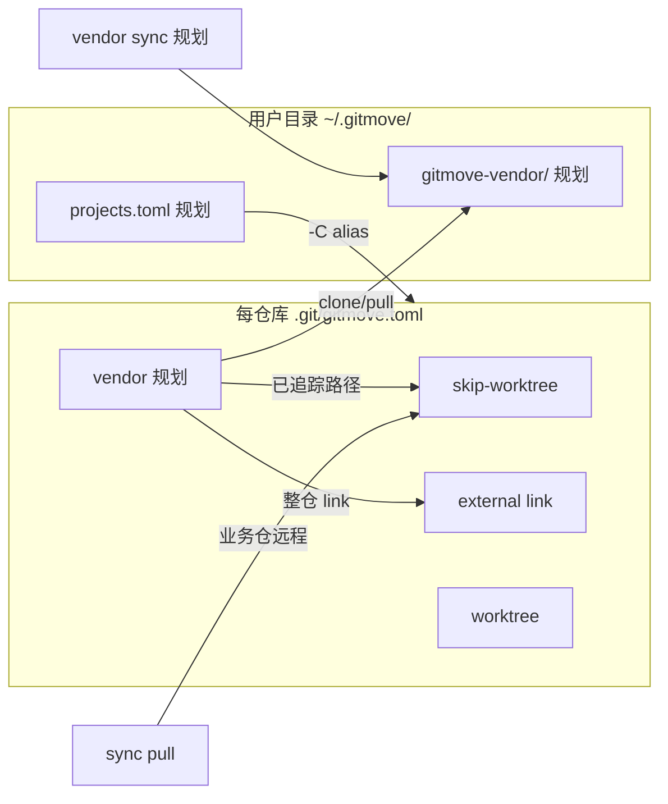

# gitmove 架构概览

## 设计原则

1. **不修改团队 `.gitignore`** — 本地策略对同事无感知
2. **配置在 `.git/` 内** — `.git/gitmove.toml` 不进入业务仓提交
3. **依赖系统 `git`** — 不捆绑 Git、不替代 Git 托管
4. **CLI 与 GUI 共用业务模块** — `doctor`、`skip`、`link`、`worktree`、`sync` 等

## 能力分层

```
┌─────────────────────────────────────────────────────────────┐
│  入口：CLI (Typer)  ·  GUI (CustomTkinter)  ·  MCP (gitmove-mcp，0.6 规划)  │
└────────────────────────────┬────────────────────────────────┘
                             │
┌────────────────────────────▼────────────────────────────────┐
│  编排层（按版本扩展）                                          │
│  · config_io   配置 import/export                             │
│  · sync        业务仓 skip 文件与远程 reconcile                │
│  · registry    多项目注册表（0.3）                        │
│  · vendor      上游仓库 → cache → link（0.4）             │
│  · api         JSON Envelope / --json（0.6 规划）           │
│  · mcp         MCP tools/resources/prompts（0.6 规划）    │
└────────────────────────────┬────────────────────────────────┘
                             │
┌────────────────────────────▼────────────────────────────────┐
│  业务层（已实现）                                              │
│  doctor · skip · link · worktree · git · platform_util        │
└────────────────────────────┬────────────────────────────────┘
                             │
┌────────────────────────────▼────────────────────────────────┐
│  Git 子进程（run_git，Windows CREATE_NO_WINDOW）               │
└─────────────────────────────────────────────────────────────┘
```

## 四种本地策略对比

| 能力 | 解决什么问题 | 内容在哪 | 典型场景 |
|------|--------------|----------|----------|
| **skip-worktree** | 已追踪文件本地改但不提交 | 仍在仓库目录内 | `config.local.json` |
| **link** | 目录指向盘外个人目录 | 外部绝对路径 | `tools/personal` |
| **worktree** | 同仓多工作区/分支 | 另一 checkout 路径 | 实验 sandbox |
| **vendor**（规划） | 目录内容来自**另一 Git 仓** | cache + link | `.cursor`、工具仓 |

## 配置与数据流

### 仓库级（每个 Git 项目一份）

文件：`<repo>/.git/gitmove.toml`

```toml
[skip-worktree]
paths = ["config.local.json"]

[external]
base = "~/gitmove-external/myrepo"

[links]
"tools/personal" = { path = "...", type = "junction" }

[worktrees]
"sandbox" = { path = "...", branch = "..." }

# 规划 v0.4
[vendors.cursor-spec]
repo_path = ".cursor"
source_url = "https://github.com/..."
```

### 用户级（全机一份，规划 v0.3）

文件：`~/.gitmove/projects.toml`

仅保存**项目指针**（路径、别名、分组），不复制各仓 skip 配置。

## 能力协作关系



| 操作 | 作用对象 | 与其他的区别 |
|------|----------|--------------|
| `gitmove apply` | 当前仓 skip/link/wt | 恢复本地策略 |
| `gitmove sync pull` | 当前仓 **业务远程** + skip 文件 | 不更新 vendor cache |
| `gitmove vendor sync`（规划） | **上游供应商** cache | 不 pull 业务仓 |
| `gitmove config import` | 当前仓 toml | 一次性/模板迁移 |
| `projects doctor --all`（规划） | 注册表内多仓 | 批量巡检 |

## 已追踪路径上的 Vendor（规划要点）

用户要求：**必须挂在指定 `repo_path`**（如已被追踪的 `.cursor`），不提供改挂 `docs/spec` 等替代路径。

策略：

1. 整仓 link：`repo_path` → `~/gitmove-vendor/<name>/`
2. 对该路径下 `git ls-files` 结果批量 **skip-worktree**
3. `doctor` 校验 link + skip 同时生效

## 模块与文件

| 模块 | 路径 | 职责 |
|------|------|------|
| `cli` | `src/gitmove/cli.py` | 命令入口 |
| `config` | `config.py` | TOML 模型、路径安全 |
| `config_io` | `config_io.py` | import/export |
| `sync` | `sync.py` | skip 与业务仓远程 |
| `doctor` | `doctor.py` | 健康检查、apply 编排 |
| `skip` / `link` / `worktree` | 各模块 | 核心策略 |
| `gui/app` | `gui/app.py` | 可视化 |
| `registry` | `registry.py` | 多项目注册表 |
| `vendor` | `vendor.py` | 上游 clone/link/sync |

## 相关文档

- [产品路线图](../product/roadmap.md)
- [典型工作流](../guides/workflows.md)
- [需求目录](../requirements/features/)
