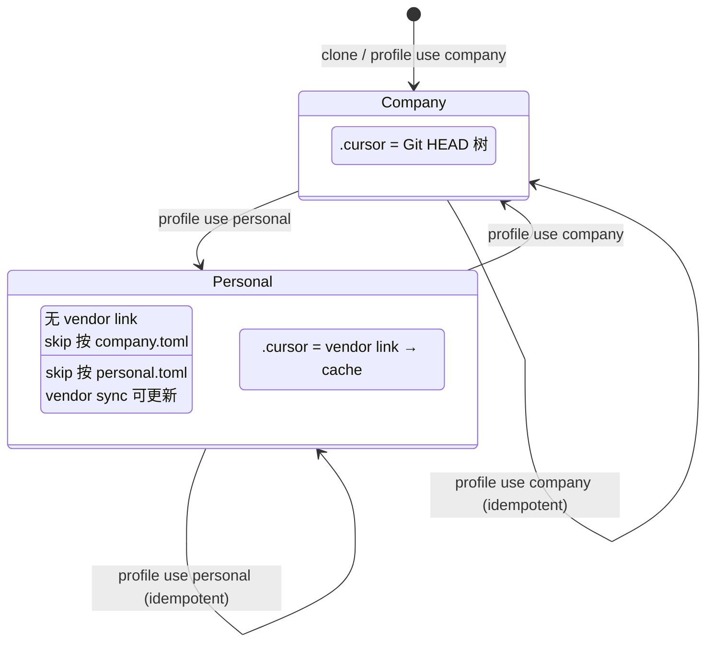

# Profile 切换资源调和（Profile Reconcile）

**状态**：已实现（0.5.2）  
**需求来源**：[gitmove-cursor-vendor-profile.md](../requirements/features/gitmove-cursor-vendor-profile.md) §6.3 Phase 2  
**目标版本**：0.5.2

**已定决策**：D1 skip 以 profile toml 为准 · D2 personal→company 自动 unskip · D3 dry_run 不 restore

---

## 1. 问题陈述

当前 `use_profile` 流程：

```text
copy2(profile.toml → gitmove.toml) → write active → apply_all()
```

**缺陷**：

| 方向 | 现象 | 根因 |
|------|------|------|
| personal → company | `.cursor` 仍指向个人 vendor cache | `apply_all` 不拆除「旧 config 有、新 config 无」的 vendor link |
| company → personal | `.cursor` 仍为 Git 检出目录，vendor link 未建立 | `apply_vendors` 在 `link_path.exists()` 时 skip 创建 |
| 双向 | skip 索引与 profile 不一致 | `skip.apply_all` 只增不减 |

Phase 2 在 **不改产品硬约束**（mount 路径、不改 `.gitignore`）前提下，使 `profile use` 成为可逆的状态机转换。

---

## 2. 设计原则

| 原则 | 在本特性中的体现 |
|------|------------------|
| **单一职责** | 新模块 `profile_reconcile.py` 只做「旧 config ↔ 新 config」资源 diff 与调和；`profile.py` 编排流程 |
| **显式优于隐式** | 切换步骤固定为 `load → diff → teardown → persist → mount → apply → exclude`；不藏副作用 |
| **不可变 diff** | `ProfileResourceDiff` 为只读 dataclass，由纯函数 `compute_profile_diff` 生成 |
| **复用现有能力** | 拆除 link 复用 `link._remove_link_path`；恢复树复用 `git restore`；挂载复用 vendor migrate 逻辑 |
| **EAFP** | 路径操作 try/remove；git restore 失败收集 warn 而非 silent pass |
| **最小破坏** | 默认 **不** `purge_cache`（personal ↔ company 往返保留 cache） |
| **可测试** | diff 纯函数单元测；往返集成测用 temp git repo + mock upstream |

---

## 3. 目标行为（状态机）



### 3.1 personal → company（teardown）

1. 识别 removed vendors（按 `vendor.name`）
2. 对每个 removed vendor 的 `repo_path`：
   - 若为 reparse point → `_remove_link_path`
   - 对 `git ls-files <repo_path>` 执行 `git restore --source=HEAD --worktree --staged -- <path>`
3. **不**删除 `~/gitmove-vendor/<name>/` cache
4. 同步 skip：旧有、新无的 path → `update-index --no-skip-worktree`
5. 写入新 config 后 `sync_link_excludes`

### 3.2 company → personal（mount）

1. 识别 added vendors
2. 对每个 added vendor 的 `repo_path`：
   - 若已是正确 vendor link → 跳过
   - 若存在普通目录/文件且 `--migrate` 语义：将内容 **合并** 进 cache（与 `vendor add --migrate` 一致），再建 link
   - 若目录内容与 HEAD 一致（可选优化）：可 `rmtree` 后直接 link（快路径）
3. `auto_skip_tracked` → 批量 skip
4. `apply_vendors` 补全 link 健康检查

### 3.3 links 对称处理

| diff | 动作 |
|------|------|
| removed_links | `remove_link(keep_external=True)` 或仅拆 link |
| added_links | `apply_links` |

worktrees 同理（v1 可仅 apply，teardown 未注册 worktree 报 doctor warn，不阻塞切换）。

---

## 4. 模块设计

### 4.1 新文件 `src/gitmove/profile_reconcile.py`

```python
@dataclass(frozen=True)
class ProfileResourceDiff:
    removed_vendors: tuple[VendorEntry, ...]
    added_vendors: tuple[VendorEntry, ...]
    removed_links: tuple[LinkEntry, ...]
    added_links: tuple[LinkEntry, ...]
    removed_skip_paths: frozenset[str]
    added_skip_paths: frozenset[str]


def compute_profile_diff(old: GitMoveConfig, new: GitMoveConfig) -> ProfileResourceDiff:
    """纯函数：按 name/repo_path 集合差集，无副作用."""


def reconcile_profile_transition(
    root: Path,
    old: GitMoveConfig,
    new: GitMoveConfig,
    *,
    purge_removed_vendor_cache: bool = False,
) -> None:
    """执行 teardown + 写 config 前/后的磁盘调和（见 §5 顺序）."""


def teardown_vendor_mount(
    root: Path,
    entry: VendorEntry,
    *,
    restore_tracked: bool = True,
) -> None:
    """拆 link + 可选 git restore；不修改 config（由调用方已持久化新 config）."""


def ensure_vendor_mount(
    root: Path,
    entry: VendorEntry,
) -> None:
    """确保 vendor link 存在；必要时 migrate 现有目录进 cache."""
```

### 4.2 修改 `src/gitmove/profile.py`

```python
def use_profile(root, name, *, dry_run=False):
    source = _profile_path(root, name)
    old_cfg = load_config(root) if config.exists() else GitMoveConfig()
    new_cfg = GitMoveConfig.load(source)

    if dry_run:
        _dry_run_profile_switch(root, old_cfg, new_cfg, name)
        return

    diff = compute_profile_diff(old_cfg, new_cfg)
    for entry in diff.removed_vendors:
        teardown_vendor_mount(root, entry)
    for entry in diff.removed_links:
        link_mod.remove_link(root, entry.repo_path, keep_external=True)

    shutil.copy2(source, config_path)
    save_config  # 已通过 copy2

    for entry in diff.added_vendors:
        ensure_vendor_mount(root, entry)
    sync_skip_paths(root, old_cfg, new_cfg)
    apply_all(root)
    sync_link_excludes(root)
    write active
```

> **注**：`load_config` 在 config 不存在时返回空 `GitMoveConfig()`，与 today 行为一致。

### 4.3 从 `vendor.py` 抽取（避免重复）

| 现有 | 抽取为 |
|------|--------|
| `_migrate_repo_path_to_cache` | 保持 private，供 `ensure_vendor_mount` 调用 |
| `add_vendor` 中 link 创建段 | `ensure_vendor_mount` 内部调用同一 helper |
| `remove_vendor` link 拆除段 | `teardown_vendor_mount` 共用 |

**不**对外新增 CLI；行为变更仅在 `profile use`。

### 4.4 `sync_skip_paths`（新 helper，可放 `skip.py`）

```python
def sync_skip_paths(root: Path, old: GitMoveConfig, new: GitMoveConfig) -> None:
    for path in set(old.skip_paths) - set(new.skip_paths):
        remove_skip(root, path, persist=False)  # config 已为新
    for path in new.skip_paths:
        if (root / path).exists() and git.is_tracked(root, path):
            git.update_index_skip(root, path, skip=True)
```

---

## 5. 执行顺序（关键）

```text
1. old_cfg ← load_config(root)
2. new_cfg ← GitMoveConfig.load(profile.toml)   # 尚未写盘
3. diff ← compute_profile_diff(old_cfg, new_cfg)
4. TEARDOWN（仍基于 old 磁盘状态）
   4a. removed_vendors → teardown_vendor_mount
   4b. removed_links   → remove_link
5. PERSIST new_cfg → gitmove.toml
6. MOUNT
   6a. added_vendors → ensure_vendor_mount
7. sync_skip_paths(old, new)
8. apply_all()          # links/worktrees/vendors 健康补全
9. sync_link_excludes()
10. write gitmove.active
```

**dry_run**：在步骤 4–8 用 tempfile/backup 或 transactional 模式；现有 dry_run 仅 copy+doctor，需扩展为「模拟 reconcile 后 doctor」。

---

## 6. 错误处理

| 场景 | 行为 |
|------|------|
| `git restore` 单文件失败 | 收集 warn；若 repo_path 根 restore 失败 → `PROFILE_RECONCILE_FAILED` |
| cache 缺失但 personal profile 需要 mount | `ensure_vendor_mount` 触发 clone（与 vendor add 相同） |
| migrate 目标非空 | 沿用 `FileExistsError` / `VENDOR_PATH_EXISTS` |
| 中途失败 | **v1 不**做完整事务回滚；文档要求用户 `profile use <previous>` 或 `git restore`；v2 可考虑 backup gitmove.toml |

错误码（`errors.py`）：

- `PROFILE_RECONCILE_FAILED`
- `PROFILE_VENDOR_MOUNT_FAILED`（wrap vendor 错误）

---

## 7. TDD 切片（RED → GREEN）

测试文件：`tests/test_cursor_vendor_profile.py`

### 7.1 顺序与门禁

| 步骤 | 测试 | 预期初始 |
|------|------|----------|
| RED-1 | `test_compute_profile_diff_removed_vendor` | 纯函数，可先 GREEN |
| RED-2 | `test_profile_use_company_removes_orphan_vendor_link` | **FAIL**（当前无 reconcile） |
| RED-3 | `test_profile_use_company_restores_cursor_from_head` | **FAIL** |
| RED-4 | `test_profile_use_personal_creates_vendor_link` | **FAIL** |
| RED-5 | `test_profile_roundtrip_personal_company_doctor_ok` | **FAIL** |
| RED-6 | `test_profile_switch_syncs_skip_paths` | **FAIL** |

### 7.2 测试夹具

```python
@pytest.fixture
def cursor_tracked_repo(git_repo):
    """在 git_repo 下创建 .cursor/rules/x.mdc 并 commit."""

@pytest.fixture
def personal_profile_vendor(vendor_home, upstream_cursor_repo):
    """返回 personal.toml 所需 vendor 配置."""

def _save_profiles(git_repo, company_cfg, personal_cfg):
    """写入 .git/gitmove.profiles/*.toml"""
```

### 7.3 断言要点

- `link_mod._is_reparse_point(git_repo / ".cursor")` personal=True, company=False
- company 模式下 `(git_repo / ".cursor/rules/foo.mdc").exists()` 且内容等于 HEAD
- `doctor` error_count == 0
- `exclude` 托管段随 profile 变化（personal 含 `/.cursor`，company 无 vendor 时可无 managed 段）

### 7.4 Checkpoint commits（TDD skill）

```text
test: add profile reconcile reproducers (T-6..T-8 RED)
fix: profile reconcile teardown and vendor mount on use
refactor: extract vendor mount helpers shared with add_vendor
```

---

## 8. 非功能要求

| 项 | 要求 |
|----|------|
| 性能 | 单仓切换 < 5s（无网络 clone）；含 clone 取决于 upstream |
| 兼容 | 无 profile 的旧 `gitmove.toml` 行为不变 |
| 安全 | 不 purge cache 除非 `--purge-cache` 扩展到 profile（v1 不做） |

---

## 9. 文档同步（实现后）

- [ ] `gitmove-cursor-vendor-profile.md` §6.3 标为已实现
- [ ] `workflows.md` / `user-manual.md` 删除 Phase 1 手动步骤
- [ ] `errors.py` remediation 文案

---

## 10. 开放项（实现前确认）

| ID | 问题 | 建议默认 |
|----|------|----------|
| D1 | company profile 是否保留部分 skip？ | 是；以 profile toml 为准 |
| D2 | personal→company 是否 unskip 全部 `.cursor` 追踪路径？ | 是，若新 profile skip_paths 未包含 |
| D3 | dry_run 是否执行真实 restore？ | 否；copy+doctor+diff 报告 only |

---

## 11. 实现顺序（纵向切片）

1. `compute_profile_diff` + 单元测试（GREEN）
2. `teardown_vendor_mount` + RED-2/3（GREEN）
3. `ensure_vendor_mount` + RED-4（GREEN）
4. `sync_skip_paths` + RED-6（GREEN）
5.  wired `use_profile` + RED-5 往返（GREEN）
6. dry_run 扩展 + 文档

**预估**：1 个 PR，~300 LOC + ~250 LOC 测试。
